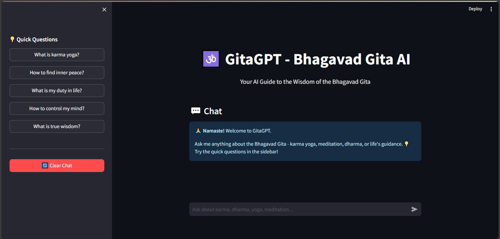
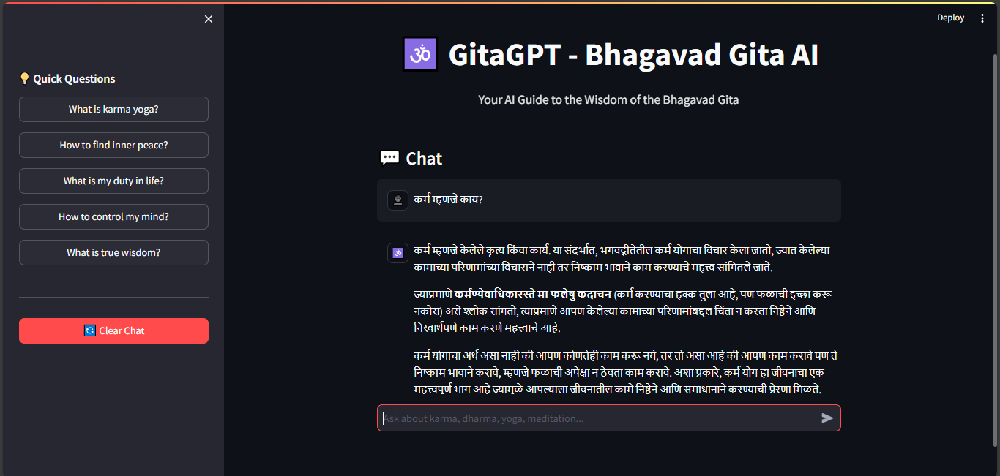

# GitaGPT - Bhagavad Gita AI Chatbot

🕉️ **GitaGPT** is an AI-powered chatbot that provides guidance from the **Bhagavad Gita**. It explains the teachings of the Gita in a simple and friendly manner, with **Sanskrit shlokas** always preserved and explained in the user’s language (Marathi or English).

---

## Features

- Ask questions about **karma yoga, dharma, meditation, life guidance**, and more.
- **Quick question buttons** for common inquiries.
- **Multilingual support** (English & Marathi).
- **Shlokas always in Sanskrit** with clear explanations.
- Conversational and friendly tone for **practical understanding**.
- **Clear chat** functionality to start a fresh conversation.

---

## Demo

1. 
2. 

---

## Installation

1. **Project Setup**
```bash
git clone https://github.com/alok-more/GitaGPT
cd Gitagpt
pip install -r requirements.txt
streamlit run app.py
```
2. **Create a `.env` file in the project root and add your Groq API key:**
```
GROQ_API_KEY=your_groq_api_key_here
```